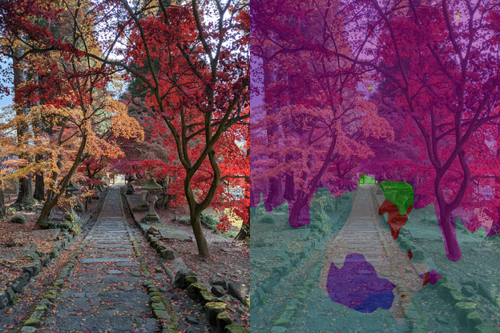

# onnx-examples

## About
ONNX Examples (Python)

## List of examples.
|[DeepLab V3+ EdgeTPUV2 and AutoSeg EdgeTPU](python/deeplabv3_edgetpuv2)|
|:--:|
|Convert TensorFlow Lite to ONNX |
||

## Reference
- [ONNX](https://onnx.ai/)
- [ONNX Runtime](https://github.com/microsoft/onnxruntime)